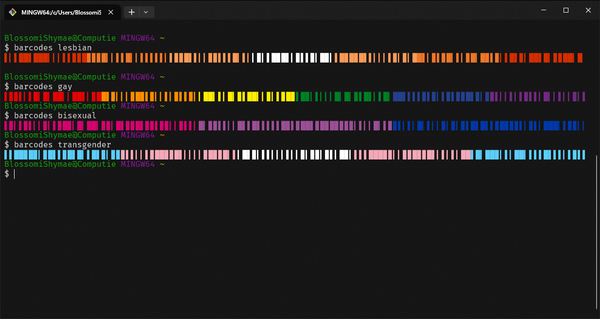

# barcodes

barcodes is a CLI utility to display your pride in the terminal.



## Install

Install barcodes:
```bash
cargo install --git https://github.com/BlossomiShymae/barcodes
```

## Contributors


<a href="https://github.com/BlossomiShymae/barcodes/graphs/contributors">
  
</a>
