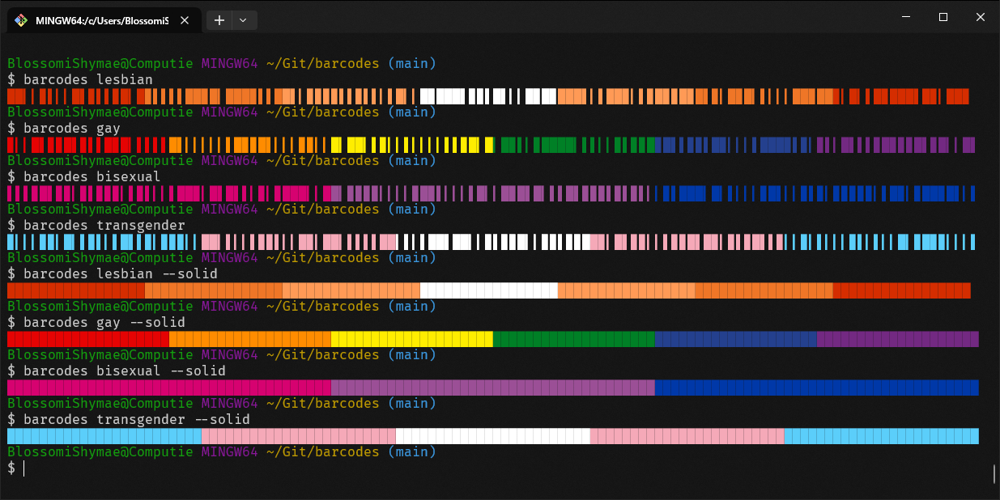

# barcodes

barcodes is a CLI utility to display your pride in the terminal.



## Contributors


<a href="https://github.com/BlossomiShymae/barcodes/graphs/contributors">
  
</a>

## Install

Install barcodes:
```bash
cargo install --git https://github.com/BlossomiShymae/barcodes
```

## Supported flags

- Lesbian
- Gay
- Bisexual
- Transgender
- Genderfluid
- Non-binary
- Asexual
- Pansexual
- Aromantic
- Agender
- Genderflux
- Genderqueer
- Transfeminine
- Transmasculine
- Aroace

Submit an issue/PR if you like to see your flag supported! :3
